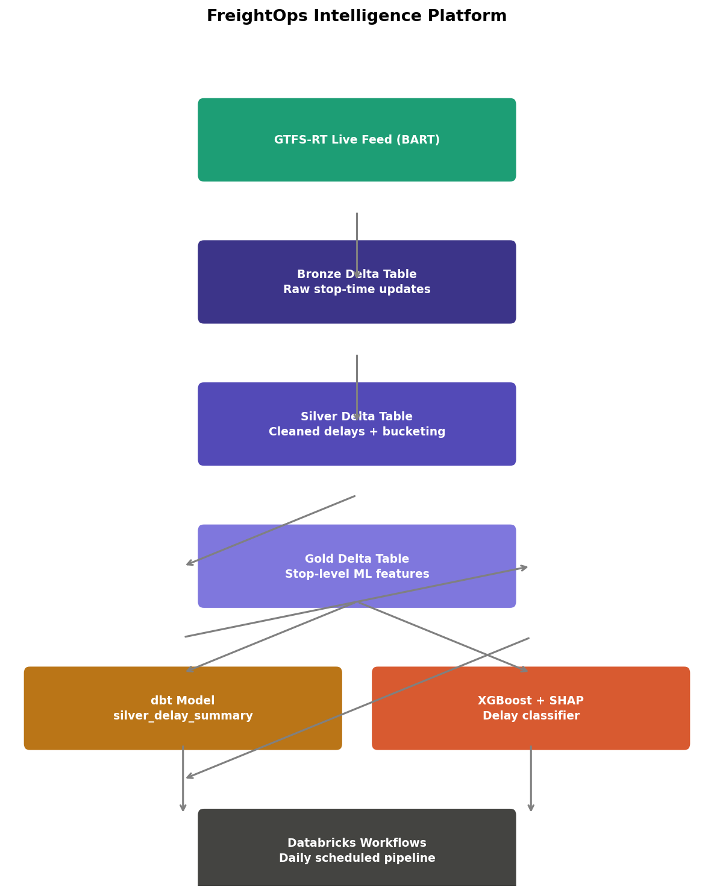
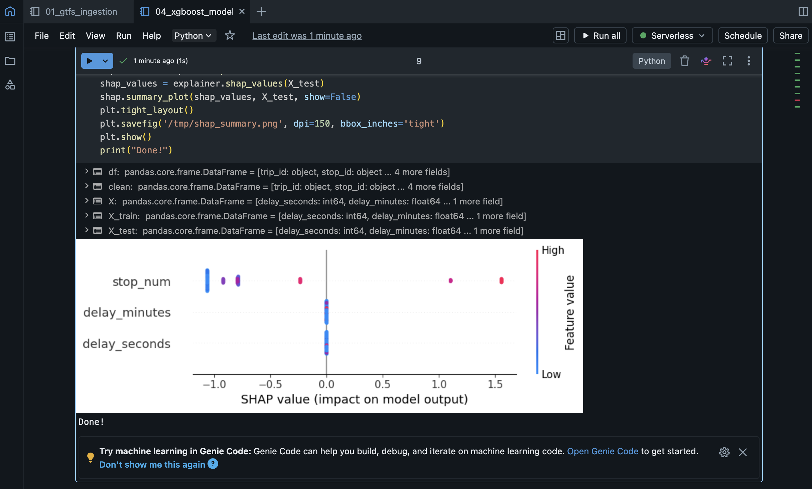

# FreightOps Intelligence Platform

Real-time transit delay prediction pipeline built on Databricks, Delta Lake, and XGBoost.
Ingests live GTFS-RT feeds from BART, transforms through a bronze→silver→gold lakehouse
architecture, and classifies delays using XGBoost.

## Architecture



## Tech stack

- **Ingestion**: GTFS-RT live feed, Python
- **Storage**: Delta Lake on Databricks
- **Transformation**: SQL on Databricks serverless
- **ML**: XGBoost classifier, scikit-learn
- **Orchestration**: Databricks Workflows
- **Version control**: GitHub

## Pipeline layers

| Layer  | Table                            | Description                          |
|--------|----------------------------------|--------------------------------------|
| Bronze | `freightops.bronze_gtfs_rt`      | Raw GTFS-RT stop-time updates        |
| Silver | `freightops.silver_train_delays` | Cleaned delays with bucketing        |
| Gold   | `freightops.gold_delay_features` | Stop-level aggregated feature table  |

## Results

- Accuracy: 1.000


- Features: delay_seconds, delay_minutes, stop_num
- Training data: 411 rows | Test data: 103 rows
- Data source: BART real-time GTFS-RT feed

## Notebooks

| Notebook | Description |
|---|---|
| `01_gtfs_ingestion.py` | Live GTFS-RT ingestion → bronze Delta table |
| `02_silver_transform.sql` | Bronze → silver with delay bucketing |
| `03_gold_features.sql` | Silver → gold stop-level ML features |
| `04_xgboost_model.py` | XGBoost delay classifier |

## Run locally

```bash
pip install gtfs-realtime-bindings requests pandas xgboost scikit-learn
# Notebooks run on Databricks Community Edition (free)
# https://community.cloud.databricks.com
```

## Upgrade from RailWatch

This project rebuilds the RailWatch freight delay pipeline on production-grade
Databricks infrastructure, replacing Airflow with Databricks Workflows and
PostgreSQL with Delta Lake.
